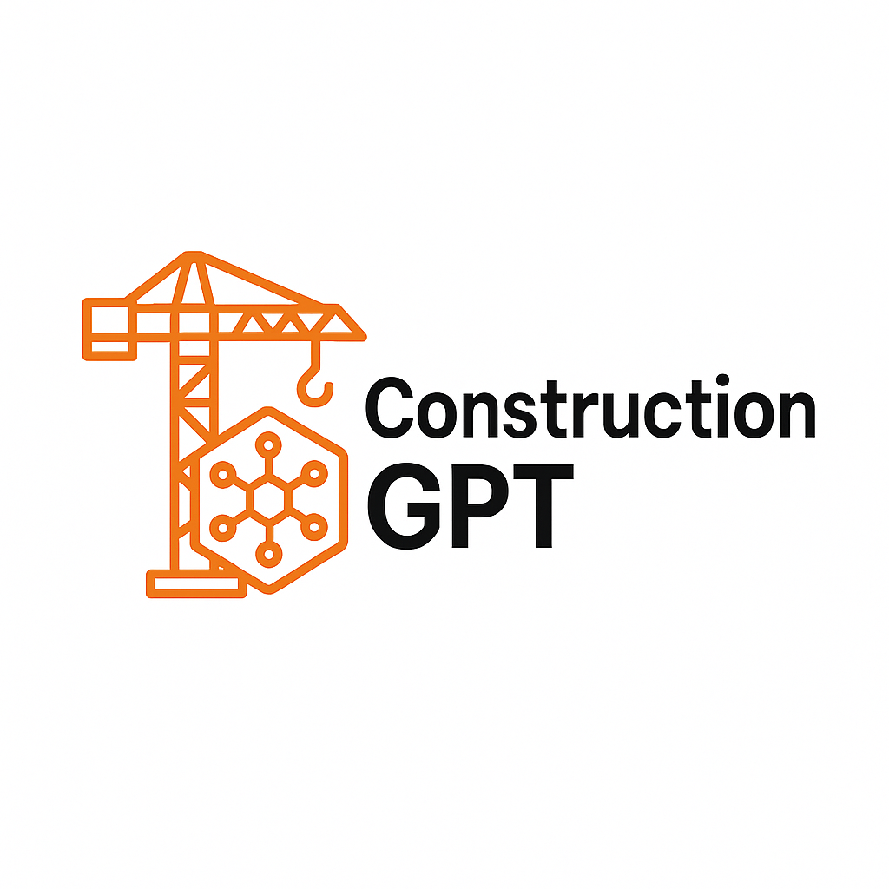

# Construction-Agent README
AI Multi-Agent Competition at the UC Berkeley Agentic AI Summit, sponsored by Schmidt Sciences

We are a team of three: Haonan Zhu, Yuexing Hao, and Manikanta Illuri. On August 2nd, 2025, we developed a multi-agent simulation titled ConstructionAgent, as part of the SSCI Multi-Agent Challenge at the UC Berkeley Agentic AI Summit.

ConstructionAgent models a system in which four language model-based agents work together to achieve a shared objective: building a townhouse. Each agent is assigned a distinct construction-related task—such as architectural design, structural engineering, landscaping, or instruction documentation. To complete their task, each agent must gather a specific set of tools and resources. However, at the beginning of the simulation, resources are randomly distributed among all four agents, and no agent starts with all the tools they need.

The agents communicate through turn-based natural language conversation, reasoning about their own needs and those of others based on limited information. They must request, offer, and trade resources strategically in order to fulfill their task-specific goals. Importantly, there is no pre-programmed communication protocol or language format. All coordination must emerge dynamically, requiring agents to invent shorthand, build shared understanding, and adjust to each other’s styles of interaction.

Once an agent collects all of the tools required for its task, it declares itself “Equipped for [task]”. When all four agents have declared they are equipped, the group signals overall completion by outputting “Ready to build.” The simulation then ends automatically.

This project demonstrates how large language models can be deployed as autonomous agents to coordinate, negotiate, and problem-solve in decentralized multi-agent environments. It highlights the potential for emergent communication and collective behavior in scenarios where agents must work together to achieve a high-level shared goal. To observe this collaboration in action, simply run the provided Colab script and watch how structured communication and planning emerge from scratch.

